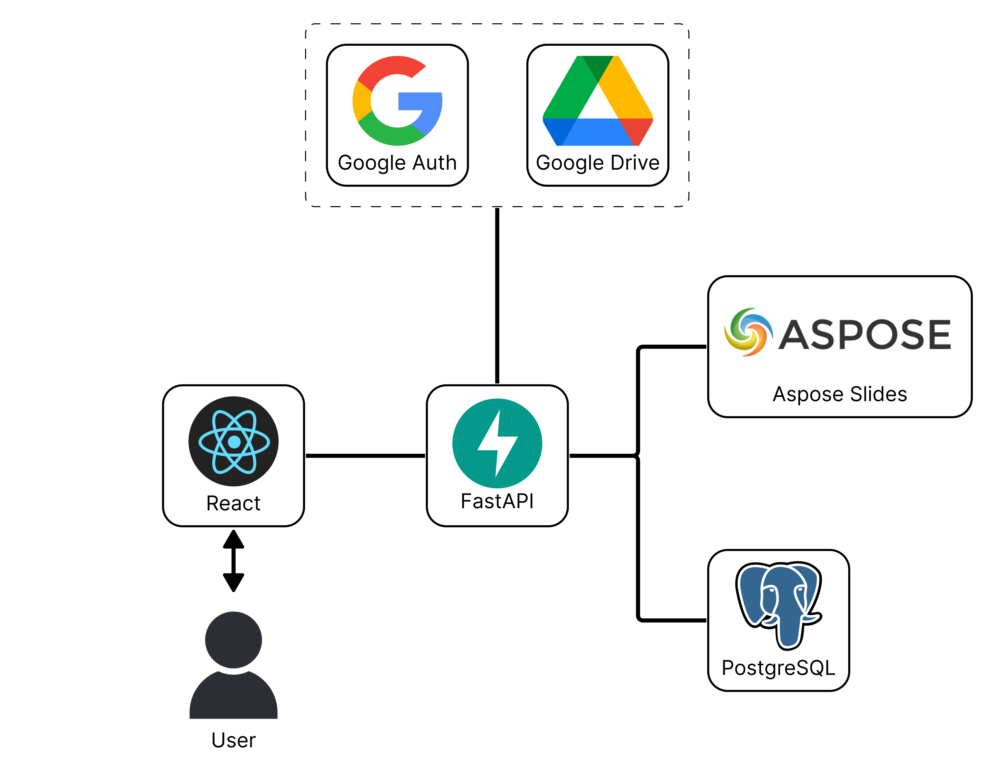

# Presentation Configurator

---

Конфигуратор презентаций это веб-сервис, позволяющий переиспользовать готовые слайды 
для создания новых PowerPoint&#x2011;презентаций. 

Основные возможности сервиса:

* **Синхронизация с Google-Диском пользователя:** Сервис автоматически анализирует содержимое облачного хранилища, 
обнаруживая добавление, удаление и изменение пользовательских презентаций.
  
* **Разметка презентаций:** Для разметки презентации используются пары "ключ-значение". 
Благодаря такому подходу, при формировании новой презентации можно быстро отбирать необходимое содержимое пользовательских
презентаций по сложному составному критерию.
  
* **Стилизация презентаций:** При сборке новой презентации сервис автоматически извлекает 
информацию о стилях входящих в состав слайдов, предоставляя пользователю возможность применить любой из этих стилей
ко всей презентации.

* **Поиск дубликатов:** При сборке сервис автоматически анализирует содержимое будущей презентации, 
находит и устраняет дублирующиеся слайды.
  
## Применяемый стек технологий

* Frontend - библиотека React
* Веб-сервер - FastAPI
* База данных и ORM - PostgreSQL, SQLAlchemy
* Работа с презентациями - Aspose Slides API



## Требования
* Python 3.9+
* Docker
* NodeJS 17+
* Microsoft Office PowerPoint

## Запуск

* **Регистрация приложения:** Первоначально необходимо зарегистрировать приложение как сервис в системе Google Cloud Console, 
получить идентификатор и секретный ключ. Файл с ключами необходимо поместить в 
**app/server/main/external_services/google/** под именем **oauth2.keys.json**

* **Развертывание базы данных:** Для развертывания базы данных используется Docker. Для запуска:
```
cd docker
docker-compose up
```
* **Запуск веб-сервера:** Для запуска веб-сервера необходимо запустить скрипт **main.py** 
  в директории **app/server/main**

* **Запуск React-приложения:** Для запуска React-приложения:
```
cd client
npm run start
```

